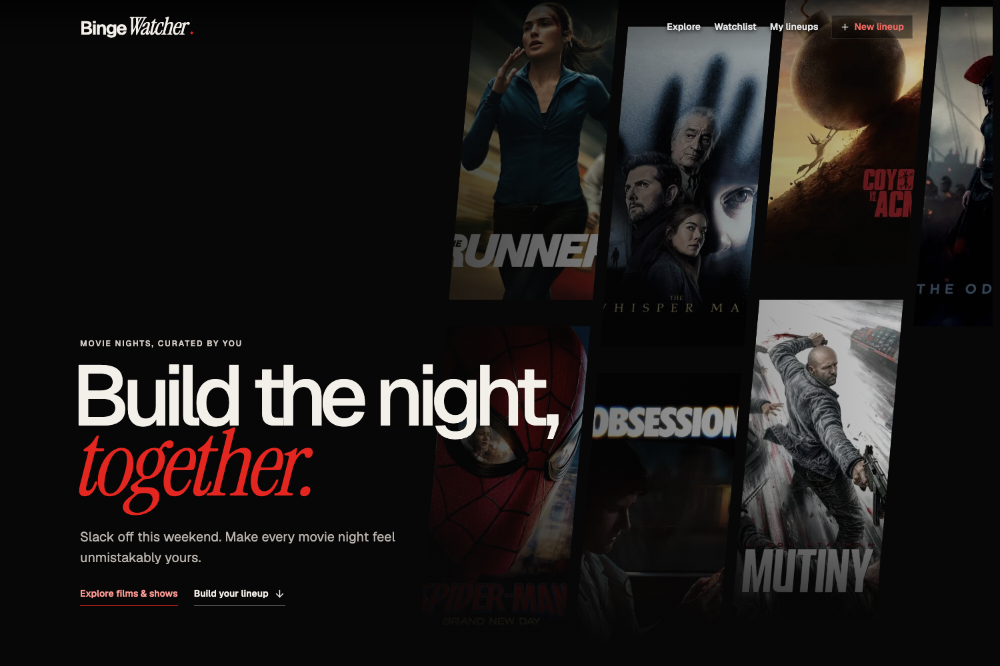

# BingeWatcher

**Build the night, together.**



BingeWatcher is a movie and TV discovery app for people and their WebMCP agents. Find something worth watching, save it for later, or build an entire lineup for movie night—without handing your taste over to an algorithm.

**[Try BingeWatcher](https://bingewatcher-prod.onrender.com)**

## Movie nights, curated by you

Deciding what to watch should not take longer than watching it.

BingeWatcher gives you one place to explore movies and shows, watch trailers, check ratings and streaming availability, save titles, track your progress, and arrange complete lineups for a night or an entire weekend.

You can do all of it yourself, or work alongside a WebMCP agent. There is no built-in chatbot pretending to know your taste. Your agent uses the same application you do, while you stay in control of every important decision.

## What you can do

### Discover something worth watching

- Browse trending movies and TV shows
- Search by title, person, theme, or whatever is on your mind
- Combine genre, language, release year, runtime, provider, and region filters
- Open rich movie, series, and season pages
- Watch trailers and explore related recommendations
- Check ratings and regional streaming availability

### Build a proper lineup

A lineup is more than a watchlist. It has an order, a theme, preferences, and room to change your mind.

- Add movies, complete TV series, or individual seasons
- Drag picks into the order you want
- Lock anything that must stay
- Mark a pick as **Not for me**, with an optional reason
- Replace or remove individual picks
- Share a read-only version with someone else
- Reopen the complete history of changes

### Keep your library with you

- Save titles to your watchlist
- Track movies at title level and TV shows episode by episode
- Mark complete seasons or series as watched
- React with **Loved it**, **Wild**, or **Not for me**
- Get recommendations based on titles you recently saved or watched

No account is required. BingeWatcher remembers you through a secure browser cookie, so your library and lineups are still there when you return from the same browser.

## Work with an agent, not under one

The main collaboration loop is simple:

1. Ask your agent to create and fill a lineup.
2. Lock a movie you definitely want to keep.
3. Reject another pick and, if you want, explain why.
4. Reorder anything yourself.
5. Ask the agent to rebuild only the remaining picks.

The agent works around your locks, vetoes, preferences, and ordering instead of wiping them away. Its actions are also visible in the interface: searches open in Explore, watchlists and lineups open on screen, and changes appear where you can immediately review them.

Everything remains fully usable without an agent.

## Using WebMCP

Open BingeWatcher in ChatGPT's in-app browser or a compatible Chrome build with `chrome://flags/#enable-webmcp-testing` enabled. The available site tools are registered through the imperative `document.modelContext.registerTool()` API.

Try requests like:

- “Find highly rated Hindi thrillers from the last ten years.”
- “Create a six-movie lineup for a chaotic Friday night and fill it.”
- “Add Knives Out to my watchlist.”
- “Keep the locked picks and rebuild the rest around my preferences.”
- “Mark episode three of this season as watched.”

The WebMCP tools call the same backend operations as the human interface. Locks, vetoes, access rules, validation, and concurrent revision checks apply regardless of whether a change comes from a person or an agent.

## Built with

- [Next.js 16](https://nextjs.org/), React 19, and TypeScript
- Tailwind CSS 4
- Bun
- SQLite with `better-sqlite3`
- [TMDB](https://www.themoviedb.org/) for movie and TV metadata
- [Streaming Availability API](https://www.movieofthenight.com/about/api) for direct provider links
- WebMCP's imperative tools API
- Docker and Render

## Run locally

### Requirements

- [Bun](https://bun.sh/)
- A [TMDB API Read Access Token](https://www.themoviedb.org/settings/api)
- An optional [Streaming Availability API](https://www.movieofthenight.com/about/api) key for direct provider links

```bash
git clone https://github.com/awesamarth/bingewatcher.git
cd bingewatcher
bun install
cp .env.example .env.local
```

Add your TMDB token to `.env.local`:

```env
TMDB_READ_API_KEY=your_token_here
```

Then start the app:

```bash
bun dev
```

Open [http://localhost:3000](http://localhost:3000). Local data is created automatically at `data/bingewatcher.db`.

## Check the project

```bash
bun test
bun run lint
bun run typecheck
bun run build
```

## Deploy to Render

The included `Dockerfile` and `render.yaml` deploy BingeWatcher as a single Render web service with a persistent disk.

1. Create a service from `render.yaml`.
2. Set `TMDB_READ_API_KEY` and optionally `STREAMING_AVAILABILITY_API_KEY`.
3. Mount the persistent disk at `/var/data`.
4. Keep `DATABASE_PATH=/var/data/bingewatcher.db`.
5. Use `/api/health` as the health-check path.

SQLite requires a single application instance. Move to a network database before enabling horizontal scaling.

## Data and access

- Anonymous visitors receive a secure, HTTP-only session cookie.
- Each lineup receives an unguessable edit/resume token.
- Read-only sharing uses a separate bearer URL.
- TMDB and streaming provider credentials stay on the server.
- Production data lives on Render's persistent disk.

## Attribution

This product uses the TMDB API but is not endorsed or certified by TMDB.

## License

BingeWatcher is available under the [MIT License](LICENSE).
